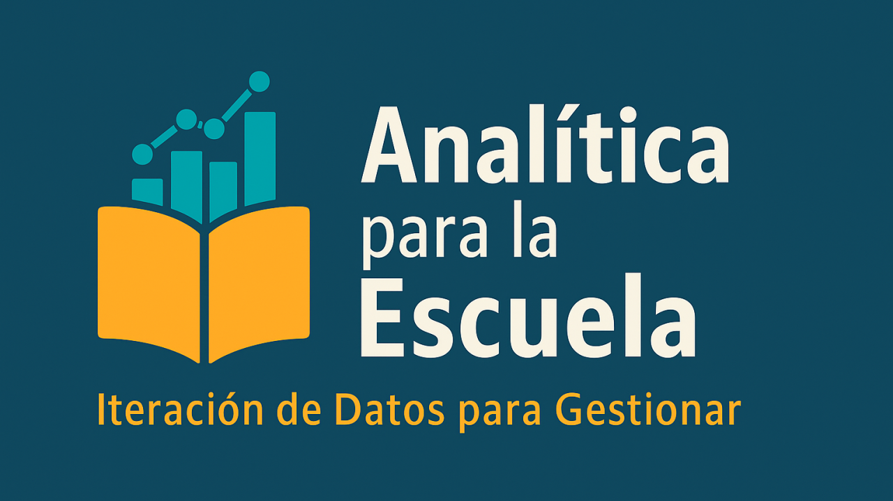

# 👋 Hola, soy Claudio Rojas

## 🎓 Educational Data Scientist | Especialista en Analítica Educativa

Transformo datos educacionales en insights accionables para mejorar la toma de decisiones en el sistema escolar chileno.

### 🔍 Mi expertise

* **20+ años** en gestión educativa (Docente, Profesor Universitario y Director Académico).
* **Magíster** en Ciencias de Datos para la Innovación (UDEC).
* **Magíster** en Gestión y Liderazgo Educacional (PUC).
* Combino conocimiento profundo del sistema educativo con Python, R y Machine Learning.

### 🚀 Proyectos destacados

| Proyecto | Descripción | Tech Stack |
| --- | --- | --- |
| [📖 analizador-lexile-chile](https://github.com/ClaudioRojasMon/analizador-lexile-chile) | Sistema de análisis de complejidad lectora adaptado al español chileno | Python, NLP |
| [📊 paes-ranking-chile](https://github.com/ClaudioRojasMon/paes-ranking-chile) | Análisis y ranking de resultados PAES 2023-2025 | Python, Pandas, Jupyter |
| [📈 Trayectorias_Academicas](https://github.com/ClaudioRojasMon/Trayectorias_Academicas) | Análisis longitudinal de rendimiento estudiantil | Machine Learning, K-means |

### 📚 Libros Interactivos — Galería Oficial de Executable Books

Dos libros publicados en la [Galería Oficial de Executable Books](https://executablebooks.org/en/latest/gallery/), colección internacional de Jupyter Books destacados de todo el mundo:

| Libro | Descripción | Enlace |
| --- | --- | --- |
| 📗 **Notas de Clases 2024** | Libro de Python para educación secundaria: Python Básico, Análisis de Datos y NLP | [📖 Ver libro](https://claudiorojasmon.github.io/Apoyo/intro.html) |
| 📘 **Programando la Historia** | IA y Python usando ejemplos de Historia de Chile y Universal para II° Medio | [📖 Ver libro](https://claudiorojasmon.github.io/apuntes_2025/intro.html) |

### 🛠️ Tech Stack


### 💼 Áreas de trabajo

* Learning Analytics
* Predicción de trayectorias académicas
* Optimización de agrupamientos estudiantiles
* Análisis de políticas educativas con datos
* Visualización de datos educacionales
* Educación e Historia
  
### 📫 Conectemos

[](https://www.linkedin.com/in/claudio-rojas-monsalves)
[](mailto:crojasmon@gmail.com)

---

💡 *Actualmente explorando oportunidades en Consultoría Educativa, EdTech y Learning Analytics*
```


